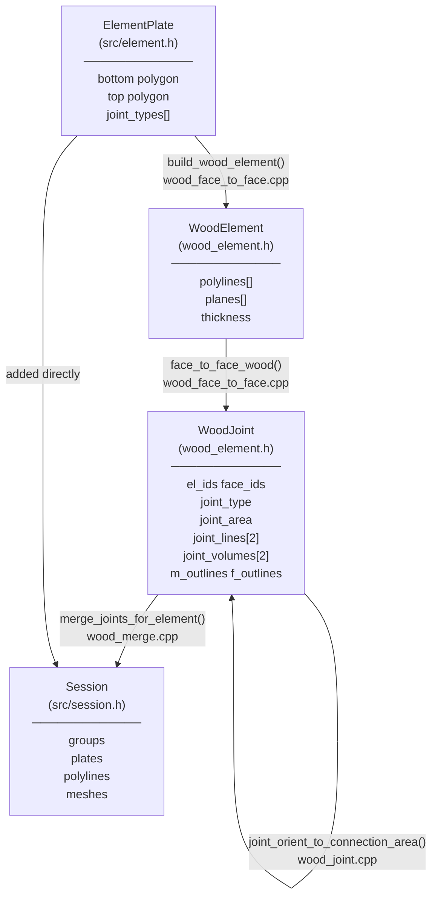

# wood — timber joint pipeline

Two plates of wood touch. This folder figures out **where** they touch,
**which teeth shape** fits that spot, and **carves** those teeth into both plates.

---

## Three things to know before reading any code

### 1. `ElementPlate` — a timber plate (from `src/element.h`)
The raw input. Carries two closed polylines (bottom face + top face) and optionally
per-face joint type ids. This is what the caller provides.

### 2. `WoodElement` — the same plate, internally pre-processed (from `wood_element.h`)
Built from an `ElementPlate` by `build_wood_element()`. Adds:
- `planes[]` — top plane [0], bottom plane [1], side planes [2..N]
- `thickness` — perpendicular distance between top and bottom
- `insertion_vectors[]` — optional assembly-direction hint per face

The pipeline works exclusively with `WoodElement` arrays internally.

### 3. `WoodJoint` — one connection between two plates (from `wood_element.h`)
Output of `face_to_face_wood()`. Carries:
- `el_ids` — which two elements this joint connects
- `face_ids` — which face on each element
- `joint_type` — 11 / 12 / 13 / 20 / 30 / 40 (see table below)
- `joint_area` — the 2D overlap polygon where plates touch
- `joint_lines[2]` — two alignment centerlines (where teeth go)
- `joint_volumes[2]` — bounding rectangles (the cut zone)
- `m_outlines` / `f_outlines` — male / female tooth profiles (filled later)

---

## What happens, step by step

```
Caller gives: vector<ElementPlate>
               ↓
[1] build_wood_element()          Compute planes, side faces, thickness.
               ↓                  → vector<WoodElement>
[2] Adjacency search              Who could touch whom?
               ↓                  → vector<pair<int,int>>  (BVH or txt file)
[3] face_to_face_wood()           For each pair: do faces actually overlap?
               ↓                    coplanarity test → 2D boolean → joint lines
                                  → vector<WoodJoint>  (type set, teeth empty)
[4] Three-valence pass            Special corners: Vidy adds shadow joints.
               ↓                  Annen shortens joint lines to avoid overlap.
[5] joint_create_geometry()       Pick tooth shape from joints/ library.
               ↓                  Fill joint.m_outlines / joint.f_outlines
                                  in a ±0.5 unit cube.
[6] joint_orient_to_connection_area()
               ↓                  Move unit-cube teeth into world space.
[7] merge_joints_for_element()    Cut the teeth into each plate's face outlines.
               ↓                  → per-element merged polylines
[8] Session filled                Plates, joint volumes, merged outlines, meshes.
               ↓
Caller calls session.pb_dump(path)
```

---

## Class and file connection diagram



---

## How to call it

```cpp
// 1. Set tuning knobs (which tooth shape per connection type)
using namespace wood_session::globals;
reset_defaults();
JOINTS_PARAMETERS_AND_TYPES[3*1+2] = 10;  // joint slot 1 → ss_e_op_1 (8-point finger)
JOINTS_PARAMETERS_AND_TYPES[3*2+2] = 20;  // joint slot 2 → ts_e_p_0  (rectangular pocket)

// 2. Load plates from a named dataset (reads session_data/<alias>.obj)
auto plates = internal::load_plates("type_plates_name_hexbox_and_corner");

// 3. Run the pipeline
Session session("WoodF2F");
get_connection_zones(plates, session, face_to_face);

// 4. Save (you control when/where)
session.pb_dump((internal::session_data_dir() / DATA_SET_OUTPUT_FILE).string());
```

For custom geometry (no file), construct `ElementPlate` directly:

```cpp
ElementPlate e0(bottom_poly_0, top_poly_0);
ElementPlate e1(bottom_poly_1, top_poly_1);
DATA_SET_INPUT_NAME  = "my_custom";
DATA_SET_OUTPUT_FILE = "WoodF2F_my_custom.pb";
get_connection_zones({e0, e1}, session, face_to_face);
```

---

## Joint type codes

| Code | Family | One-liner |
|------|--------|-----------|
| 11 | ss_e_op | sides touch, teeth stick **out** |
| 12 | ss_e_ip | sides touch, teeth stay **in** |
| 13 | ss_e_r  | sides touch but **rotated/skew** |
| 20 | ts_e_p  | **top** of A meets **side** of B |
| 30 | cr_c_ip | plates **cross** like scissors |
| 40 | tt_e_p  | **top** meets **top** |

The variant_id in `JOINTS_PARAMETERS_AND_TYPES[3*slot+2]` picks the exact constructor:
`1–9` → ss_e_ip, `10–19` → ss_e_op, `20–29` → ts_e_p, `30–39` → cr_c_ip, `50–59` → ss_e_r.

---

## File map

| File | What it does |
|---|---|
| `wood_session.h` | Public API: `get_connection_zones`, `load_plates`, globals, all 43 test declarations |
| `wood_element.h/cpp` | `WoodElement` and `WoodJoint` structs + constructors |
| `wood_face_to_face.h/cpp` | `build_wood_element` (stage 1) + `face_to_face_wood` (stage 3) |
| `wood_joint.h/cpp` | `joint_orient_to_connection_area`, `merge_linked_joints`, `joint_get_divisions` |
| `wood_joint_detection.cpp` | `plane_to_face` — cross-joint detector (type 30 only) |
| `wood_merge.h/cpp` | `merge_joints_for_element` — cuts teeth into plate outlines |
| `wood_main.cpp` | `run_connection_zones_pipeline` + public `get_connection_zones` |
| `wood_globals.cpp` | All tuning globals + `reset_defaults()` |
| `wood_internal.cpp` | `load_plates`, `load_polylines`, `plates_exist`, `session_data_dir` |
| `wood_cut.h` | Enum: hole / edge_insertion / drill / mill / mill_project |
| `wood_joint_lib.h` | Aggregator — includes all `joints/*.h` in dependency order |
| `joints/*.h` | One file per tooth shape. Each is a static function filling unit-cube outlines |
| `wood_test.cpp` | 43 dataset test functions |
| `wood_beams.cpp` | Beam version: `beam_volumes_pipeline` (phanomema_node) |

---

## How to add a new tooth shape

1. Create `joints/ss_e_op_7.h` with `static void ss_e_op_7(WoodJoint& joint)` that fills
   `joint.m_outlines[0..1]` and `joint.f_outlines[0..1]` inside ±0.5 unit-cube space.
2. In `wood_joint_lib.h`, add `#include "joints/ss_e_op_7.h"` after `ss_e_op_4.h`.
3. In `joint_create_geometry()` (`wood_main.cpp`), add `case 17: ss_e_op_7(joint); break;`
4. In your test: `JOINTS_PARAMETERS_AND_TYPES[3*1 + 2] = 17;`

`joint_orient_to_connection_area()` handles all world-space math — never write world coordinates
in a joint constructor.

---

## Auxiliary per-dataset files (all optional)

| Pattern | Purpose |
|---|---|
| `<name>_adjacency.txt` | Explicit pair list — skips BVH search |
| `<name>_three_valence.txt` | Three-valence linking (Vidy-style corners) |
| `<name>_insertion_vectors.txt` | Per-element assembly direction (Annen-style) |
| `<name>_joints_types.txt` | Per-face variant id override |

`load_plates(name)` sets `DATA_SET_INPUT_NAME` so the pipeline resolves these automatically.

---

## Kernel functions extracted from wood

Two geometry helpers with zero wood-specific dependencies live in the session kernel:

| Function | Location |
|---|---|
| `polyline_two_rects_from_frame` | `src/polyline.h` |
| `Intersection::line_line_classified` | `src/intersection.h` |
